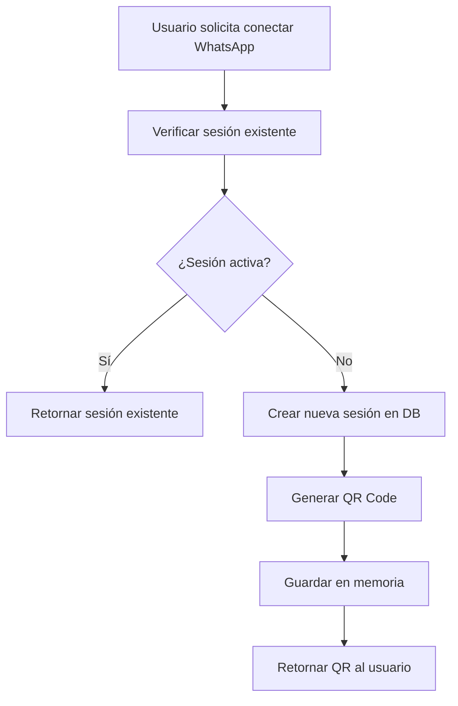
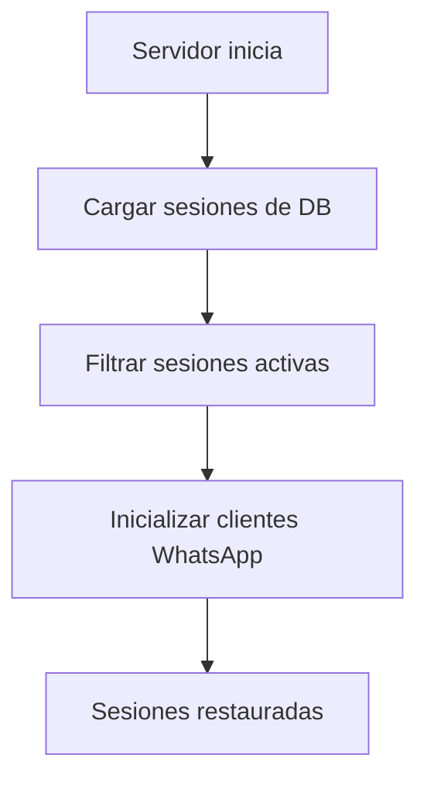
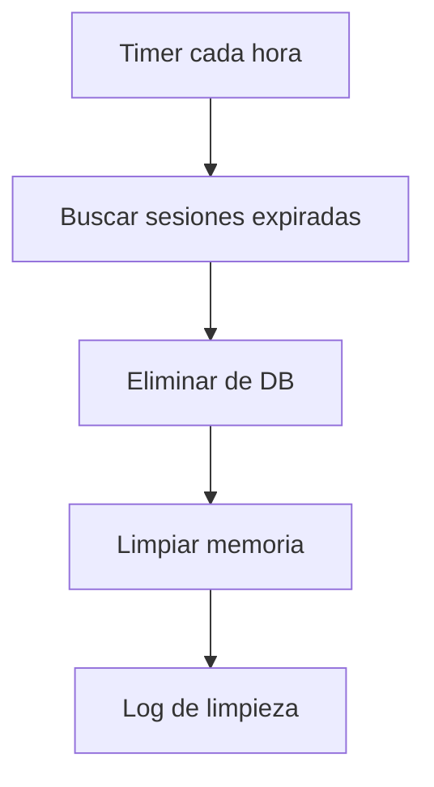

# 🔄 Sesiones Persistentes de WhatsApp Web

## 📋 Resumen

Se ha implementado un sistema completo de **sesiones persistentes** para WhatsApp Web que permite:

- ✅ **Persistencia en base de datos**: Las sesiones se guardan en PostgreSQL
- ✅ **Recuperación automática**: Al reiniciar el servidor, las sesiones se restauran
- ✅ **Gestión de expiración**: Sesiones con fecha de expiración automática
- ✅ **Limpieza automática**: Proceso que limpia sesiones expiradas cada hora
- ✅ **Estadísticas**: Monitoreo de sesiones activas, expiradas y totales
- ✅ **API completa**: Endpoints para gestionar sesiones persistentes

## 🗄️ Base de Datos

### Tabla `whatsapp_sessions`

```sql
CREATE TABLE whatsapp_sessions (
    id UUID PRIMARY KEY DEFAULT gen_random_uuid(),
    user_id UUID NOT NULL REFERENCES users(id) ON DELETE CASCADE,
    session_id VARCHAR(255) UNIQUE NOT NULL,
    qr_code TEXT,
    is_connected BOOLEAN DEFAULT FALSE,
    is_authenticated BOOLEAN DEFAULT FALSE,
    phone_number VARCHAR(20),
    user_name VARCHAR(255),
    last_seen TIMESTAMP,
    expires_at TIMESTAMP,
    created_at TIMESTAMP DEFAULT CURRENT_TIMESTAMP,
    updated_at TIMESTAMP DEFAULT CURRENT_TIMESTAMP
);
```

### Índices de Optimización

- `idx_whatsapp_sessions_user_id`: Búsqueda por usuario
- `idx_whatsapp_sessions_session_id`: Búsqueda por ID de sesión
- `idx_whatsapp_sessions_expires_at`: Limpieza de sesiones expiradas
- `idx_whatsapp_sessions_connected`: Filtrado por estado de conexión

## 🔧 Servicios

### `WhatsAppPersistentService`

Servicio principal que maneja:

- **Gestión de sesiones**: Crear, actualizar, eliminar
- **Persistencia**: Sincronización con base de datos
- **Recuperación**: Carga automática al iniciar
- **Limpieza**: Eliminación de sesiones expiradas
- **Eventos**: Manejo de eventos de WhatsApp Web

### Características Principales

1. **Singleton Pattern**: Una instancia global del servicio
2. **Event-Driven**: Sistema de eventos para notificaciones
3. **Auto-Recovery**: Restaura sesiones al reiniciar
4. **Cleanup Interval**: Limpieza automática cada hora
5. **Memory + DB**: Cache en memoria + persistencia en DB

## 🌐 API Endpoints

### Gestión de Sesiones

#### `POST /api/integrations/whatsapp/session`
Crear nueva sesión de WhatsApp Web

**Respuesta:**
```json
{
  "success": true,
  "data": {
    "sessionId": "whatsapp_userId_timestamp",
    "qrCode": "data:image/png;base64,..."
  },
  "message": "Sesión de WhatsApp creada exitosamente"
}
```

#### `GET /api/integrations/whatsapp/qr`
Obtener código QR de la sesión

#### `GET /api/integrations/whatsapp/status`
Verificar estado de conexión

#### `POST /api/integrations/whatsapp/disconnect`
Desconectar sesión

### Gestión de Sesiones Persistentes

#### `GET /api/integrations/sessions/stats`
Obtener estadísticas de sesiones

**Respuesta:**
```json
{
  "success": true,
  "data": {
    "total": 5,
    "active": 2,
    "expired": 1
  },
  "message": "Estadísticas de sesiones obtenidas exitosamente"
}
```

#### `POST /api/integrations/sessions/cleanup`
Limpiar sesiones expiradas manualmente

**Respuesta:**
```json
{
  "success": true,
  "data": {
    "cleanedCount": 3
  },
  "message": "3 sesiones expiradas limpiadas exitosamente"
}
```

## 🔄 Flujo de Sesiones Persistentes

### 1. Creación de Sesión



### 2. Recuperación Automática



### 3. Limpieza Automática



## 📊 Monitoreo y Estadísticas

### Métricas Disponibles

- **Total**: Número total de sesiones creadas
- **Activas**: Sesiones conectadas y autenticadas
- **Expiradas**: Sesiones que han superado su fecha de expiración

### Logs del Sistema

```
[INFO] Loading existing WhatsApp sessions from database...
[INFO] Loaded 3 existing sessions
[INFO] Persistent WhatsApp session created: whatsapp_userId_timestamp
[INFO] Cleaned up 2 expired WhatsApp sessions
```

## ⚙️ Configuración

### Variables de Entorno

```env
# Base de datos
DB_HOST=postgres
DB_PORT=5432
DB_NAME=flame_assistant
DB_USER=flame_user
DB_PASSWORD=flame_password

# Puppeteer
PUPPETEER_SKIP_CHROMIUM_DOWNLOAD=true
PUPPETEER_EXECUTABLE_PATH=/usr/bin/chromium-browser
```

### Configuración de Sesiones

- **Expiración**: 24 horas por defecto
- **Limpieza**: Cada hora automáticamente
- **Persistencia**: LocalAuth con directorio `./sessions/`

## 🚀 Uso en Frontend

### Crear Sesión

```javascript
const response = await fetch('/api/integrations/whatsapp/session', {
  method: 'POST',
  headers: {
    'Authorization': `Bearer ${token}`
  }
});

const data = await response.json();
if (data.success) {
  // Mostrar QR code: data.data.qrCode
  // Session ID: data.data.sessionId
}
```

### Verificar Estado

```javascript
const response = await fetch('/api/integrations/whatsapp/status', {
  headers: {
    'Authorization': `Bearer ${token}`
  }
});

const data = await response.json();
if (data.success) {
  // Estado: data.data.isConnected
  // Autenticado: data.data.isAuthenticated
}
```

## 🔒 Seguridad

### Medidas Implementadas

1. **Autenticación JWT**: Todas las rutas requieren token válido
2. **Aislamiento de sesiones**: Cada usuario solo ve sus sesiones
3. **Expiración automática**: Sesiones con tiempo límite
4. **Limpieza regular**: Eliminación de datos obsoletos
5. **Validación de entrada**: Sanitización de parámetros

### Consideraciones

- Las sesiones se almacenan con `LocalAuth` de WhatsApp Web
- Los datos sensibles se mantienen en el servidor
- Las sesiones expiran automáticamente
- Limpieza regular de datos obsoletos

## 📈 Beneficios

### Para el Usuario

- ✅ **Sin re-escaneo**: No necesita escanear QR cada vez
- ✅ **Sesiones duraderas**: Mantiene conexión entre reinicios
- ✅ **Estado persistente**: Recuerda configuración y estado
- ✅ **Mejor UX**: Experiencia más fluida

### Para el Sistema

- ✅ **Escalabilidad**: Manejo eficiente de múltiples sesiones
- ✅ **Confiabilidad**: Recuperación automática de fallos
- ✅ **Monitoreo**: Estadísticas y logs detallados
- ✅ **Mantenimiento**: Limpieza automática de recursos

## 🎯 Próximos Pasos

1. **Implementar WhatsApp Web real**: Reemplazar QR de prueba
2. **Notificaciones en tiempo real**: WebSocket para eventos
3. **Dashboard de sesiones**: Interfaz de gestión
4. **Métricas avanzadas**: Gráficos y alertas
5. **Backup de sesiones**: Respaldo automático

---

## 📞 Soporte

Para cualquier consulta sobre las sesiones persistentes:

- **Logs**: Revisar `logs/combined.log`
- **Base de datos**: Consultar tabla `whatsapp_sessions`
- **API**: Usar endpoints de estadísticas y limpieza
- **Monitoreo**: Verificar métricas de sesiones

¡El sistema de sesiones persistentes está completamente funcional! 🚀
